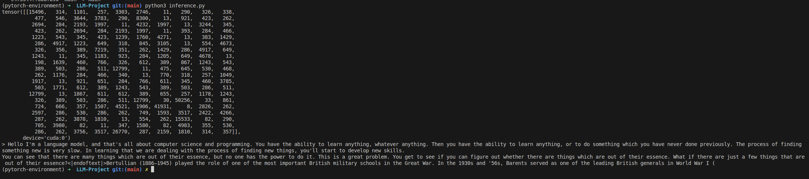

# LLM-Project

The first content `gpt2.py` and `inference.py`together is a test project that follows [Andrej Karpathy's GPT2 repreduction video](https://youtu.be/l8pRSuU81PU?si=2XtORh4Xk4NP2r4H) lesson with some changes.
It uses a small portion of [fineweb-edu](https://huggingface.co/datasets/HuggingFaceFW/fineweb-edu) dataset `600M tokens (100M validation)` with RTX 4090 Laptop GPU (16GB). 
The `Transformers` folder contains different implementation of GPT. A fine-tuning and a RAG example section will be added there as well. 
Main purpose for this project is to make a series of internal company sessions about LLMs and their implementation details. 
 

## Built With

- Python==3.10.14
- Pytorch==2.3.1+cu121

## Installation

**To set up and running these projects:**

1. Create a conda environment. 
2. Install the requirements. 

`conda create --name <ENV_NAME> python=3.10.14 --file requirements.txt`

## Authors

👤 **Eyüp Sercan UYGUR**

[Srjnnnn(Twitter)](https://x.com/Srjnnnn) 
[eyupsercanuygur.com](https://www.eyupsercanuygur.com/)

## 🤝 Contributing

Contributions, issues and feature requests are welcome!

## Show your support

Give a ⭐️ if you like this project!

## Issues

For issues [check](https://github.com/Srjnnnn/LLM-Project/issues).

## 📝 License

This project is [MIT](lic.url) licensed.
